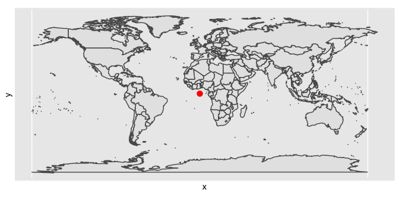

# Learn with me about *spatial data*

<blockquote>

Hi everyone!

Day 1️⃣ Spatial data

Today I’m going to dig into some spatial data 🗺️ featuring the following
packages:

📦 maps & mapproj @AlexDeckmyn & co 📦 ggplot2 @hadleywickham/@thomasp85
& co 📦 sf @edzerpebesma 📦🔧🇦🇺 strayr @wfmackey & co

\#rstats \#rladies \#rspatial

</blockquote>

``` r
library(gganimate)
library(tidyverse)
map_data("world2") %>% 
  mutate(aust = region=="Australia") %>% 
  ggplot(aes(long, lat, group = group, fill = aust)) +
  geom_polygon() +
  guides(fill = "none")  +
  theme_void() + 
  scale_fill_manual(values = c("#00843D", "#FFCD00")) + 
  transition_states(aust, transition_length = 2, state_length = 1) +
  shadow_mark(past = TRUE, future = TRUE, colour = 'grey') +
  view_zoom_manual(pause_length = 1, 
                   step_length = 2, 
                   pan_zoom = 3,
                   xmin = c(97, 0), xmax = c(175, 360),
                   ymin = c(-54, -90), ymax = c(-10, 84))
```

<!-- -->

<blockquote>

Day 1️⃣ \#1

If you deal with spatial data, you likely need to augment it with a map
data to analyse your data with a geographical context.

Map data is often auxiliary & you often wanna quickly get it.

📦 {maps} by @AlexDeckmyn & co ports the data from
<https://naturalearthdata.com>

</blockquote>

``` r
maps::map("world", region = ".",  fill = TRUE, col = "#88398a")
```

<!-- -->

``` r
str(maps::map("world", region = ".", plot = FALSE))
```

    ## List of 4
    ##  $ x    : num [1:82403] -69.9 -69.9 -69.9 -70 -70.1 ...
    ##  $ y    : num [1:82403] 12.5 12.4 12.4 12.5 12.5 ...
    ##  $ range: num [1:4] -180 190.3 -85.2 83.6
    ##  $ names: chr [1:1627] "Aruba" "Afghanistan" "Angola" "Angola:Cabinda" ...
    ##  - attr(*, "class")= chr "map"

<blockquote>

Day 1️⃣ \#2

If you want to have the map data in a tidy form, particularly ready for
plotting, there’s a handy function in {ggplot2} that calls {maps} under
the hood.

ggplot2::map_data(“world”)

\#rstats \#rspatial \#rladies

</blockquote>

``` r
str(ggplot2::map_data("world"))
```

    ## 'data.frame':    99338 obs. of  6 variables:
    ##  $ long     : num  -69.9 -69.9 -69.9 -70 -70.1 ...
    ##  $ lat      : num  12.5 12.4 12.4 12.5 12.5 ...
    ##  $ group    : num  1 1 1 1 1 1 1 1 1 1 ...
    ##  $ order    : int  1 2 3 4 5 6 7 8 9 10 ...
    ##  $ region   : chr  "Aruba" "Aruba" "Aruba" "Aruba" ...
    ##  $ subregion: chr  NA NA NA NA ...

<blockquote>

Day 1️⃣ \#3

If you want to create a choropleth map then you’d usually need to merge
your map data with your data. The most difficult part might be matching
the region names when merging the two datasets!

\#rstats \#rspatial \#rladies

</blockquote>

``` r
library(tidyverse) # includes ggplot2

usmap <- map_data("state") 

data <- USArrests %>% 
  rownames_to_column("state") %>% 
  mutate(state = tolower(state)) %>% 
  left_join(usmap, by = c("state" = "region"))

ggplot(data, aes(long, lat, group = group, fill = UrbanPop)) +
  geom_polygon(color = "black") +
  theme_void() +
  scale_fill_viridis_c() +
  labs(title = "Percentage of urban population by state in US in 1973", 
       fill = "Percentage")
```

<!-- -->

<blockquote>

Day 1️⃣ \#4

There’s a quick easy way to visualise map data in {ggplot2} and that’s
using the ggplot2::borders() function.

Here’s an example of a (sort-of) Dorling cartogram for the urban
population in USA 🌎

\#rstats \#rspatial \#rladies

</blockquote>

``` r
library(tidyverse)

data <- USArrests %>% 
  rownames_to_column("state") %>% 
  left_join(usa::states, by = c("state" = "name"))

str(data)
```

    ## 'data.frame':    50 obs. of  12 variables:
    ##  $ state   : chr  "Alabama" "Alaska" "Arizona" "Arkansas" ...
    ##  $ Murder  : num  13.2 10 8.1 8.8 9 7.9 3.3 5.9 15.4 17.4 ...
    ##  $ Assault : int  236 263 294 190 276 204 110 238 335 211 ...
    ##  $ UrbanPop: int  58 48 80 50 91 78 77 72 80 60 ...
    ##  $ Rape    : num  21.2 44.5 31 19.5 40.6 38.7 11.1 15.8 31.9 25.8 ...
    ##  $ abb     : chr  "AL" "AK" "AZ" "AR" ...
    ##  $ fips    : chr  "01" "02" "04" "05" ...
    ##  $ region  : Factor w/ 4 levels "Northeast","Midwest",..: 3 4 4 3 4 4 1 3 3 3 ...
    ##  $ division: Factor w/ 9 levels "New England",..: 6 9 8 7 9 8 1 5 5 5 ...
    ##  $ area    : num  50647 571017 113653 52038 155854 ...
    ##  $ lat     : num  32.7 63.4 34.3 34.9 37.2 ...
    ##  $ long    : num  -86.8 -152.9 -111.7 -92.4 -119.5 ...

``` r
ggplot(data, aes(long, lat)) + 
  borders("state") +
  geom_point(aes(size = UrbanPop),
             alpha = 0.5)  +
  theme_void() +
  scale_color_viridis_c() +
  labs(title = "Percentage of urban population by state in US in 1973", 
       size = "Percentage")
```

<!-- -->

<blockquote>

Day 1️⃣ \#5

🌍 Geographic coordinate reference system (CRS) identify a location on
the Earth’s surface by longitude and latitude.

🌐 Projected CRS are result of map projections of geographic CRS onto
Cartesian coordinate on a flat surface

This simply means that Earth is a sphere but there’s many 2D views of
it. Compare Antarctica in the images and also where the red dot is!

\#rstats \#rspatial \#rladies

</blockquote>

``` r
library(sf)
library(maps)
library(tidyverse)
world1 <- st_as_sf(map('world', plot = FALSE, fill = TRUE))
world2 <- st_transform(
  world1,
  "+proj=laea +y_0=0 +lon_0=155 +lat_0=-90 +ellps=WGS84 +no_defs"
)
pt <- data.frame(x = 0, y = 0) %>% 
  st_as_sf(coords = 1:2, crs = st_crs(world1)) %>% 
  st_transform(st_crs(world2))

ggplot() + 
  geom_sf(data = world2)  +
  geom_sf(data = pt, color = "red", size = 3)
```

<!-- -->

``` r
ggplot() + 
  geom_sf(data = world1) +
  annotate("point", x = 0, y = 0, color = "red",
           size = 3)
```

<!-- -->

<blockquote>

Day 1️⃣ \#6

🌑 mapproj::mapproject and sf::st_transform provides ways to convert lat
and lon to projected coordinates – the former uses a C library by Lucent
Technologies Inc while the latter uses proj4string (<https://proj.org/>)
to do the projection under the hood.

\#rstats \#rspatial \#rladies

</blockquote>

``` r
library(ggplot2)

ggplot() + 
  annotate("rect", xmin = -Inf, xmax = Inf, ymin = -Inf, ymax = Inf, 
           fill = "skyblue", color = "black") +
  borders("world2", fill = "#88398a", colour = "black") +
  theme_void() 
```

<!-- -->

``` r
library(patchwork)
library(ggplot2)
g1 <- ggplot() + 
  annotate("rect", xmin = -Inf, xmax = Inf, ymin = -Inf, ymax = Inf, 
           fill = "skyblue", color = "black") +
  borders("world2", fill = "#88398a", colour = "black") +
  theme_void() 

g2 <- g1 + coord_map("gilbert")

g1 + g2
```

<!-- -->

``` r
library(patchwork)
library(ggplot2)
library(sf)

world <- st_as_sf(maps::map("world", plot = FALSE, fill = TRUE))

g1 <- ggplot(world) + 
  geom_sf() + 
  theme_void() 

worldt <- st_transform(
  world,
  "+proj=laea +y_0=0 +lon_0=155 +lat_0=-90 +ellps=WGS84 +no_defs"
)

g2 <- ggplot(worldt) + 
  geom_sf() + 
  theme_void() 

g1 + g2
```

<!-- -->

<blockquote>

Day 1️⃣ \#7

🇦🇺 Now for the Aussies and those interested out there!

📦 {strayr} by @wfmackey & co is a dev package that includes ABS mapping
structures via downloading from {absmapsdata} repo by @wfmackey

Many of the functions and maps are Australian specific but you can
perhaps find something similar in your own region?

\#rstats \#rspatial \#rladies

</blockquote>

``` r
library(ggplot2)
library(strayr) # remotes::install_github("runapp-aus/strayr")
ced2021 <- read_absmap("ced2021")

ggplot(ced2021) + 
  geom_sf()
```

<!-- -->

<blockquote>

If {strayr} interests you or more broadly, Australian Public Policy +
\#rstats interests you, there is a Slack group for that with lots of
active and friendly folks!

🔗 <https://runapp-aus.github.io/runapp_website/join.html>

</blockquote>
