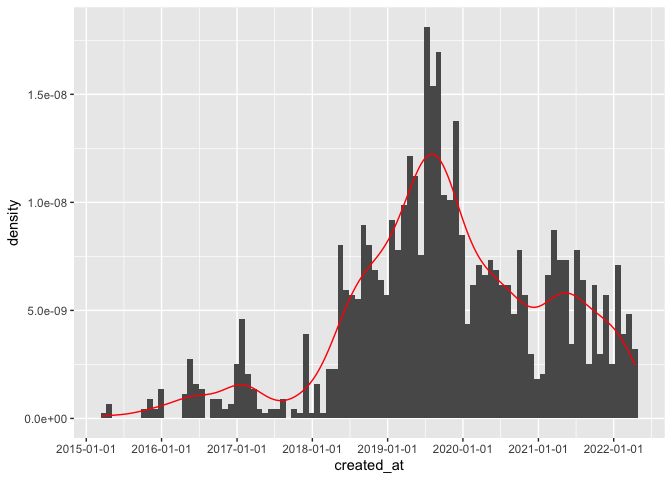
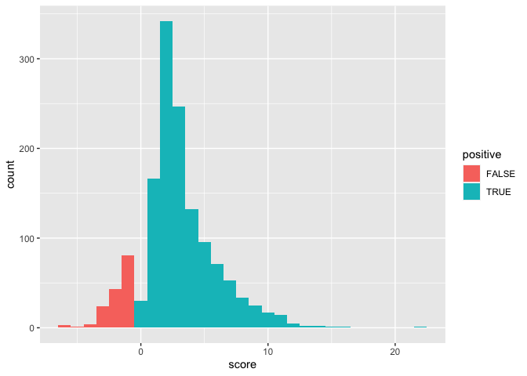

# Learn with me about *twitter analysis*

<blockquote>

Hi folks!

Day 2️⃣ Twitter analysis

Today’s going to be about analysing my twitter data but you can
replicate with your own. The main packages are:

📦 rtweet @kearneymw & co 📦 tidytext @juliasilge & co 📦 gender
@lincolnmullen

w/ help from {tidyverse} ✨

\#rstats \#rladies

</blockquote>
<blockquote>

Day 2️⃣ \#1

📦 {rtweet} allows you to get your (or another public user) tweets.

⚠️ It has a limitation of getting the last \~3200 tweets from a user.

📉 The graph shows frequency of my tweets over time – you can see I
tweeted more in 2019 than recent years.

\#rstats \#rladies

</blockquote>

``` r
library(rtweet)
emi_tweets <- get_timeline("statsgen", n = Inf)
nrow(emi_tweets)
```

    ## [1] 3250

``` r
emi_tweets %>% 
  filter(!is_retweet & is.na(reply_to_status_id)) %>% 
  ggplot(aes(created_at)) +
  # make width = 4 weeks = 60s x 60 min x 24 hours x 7 days x 4 weeks
  geom_histogram(binwidth = 60 * 60 * 24 * 7 * 4,
                 aes(y = stat(density))) +
  geom_density(color = "red") +
  scale_x_datetime(date_breaks = "1 year")
```

<!-- -->

<blockquote>

Day 2️⃣ \#2

You may want to analyse ALL your twitter data.

In that case you can download the archive of your twitter from your
twitter profile settings.

You data is in the file `tweet.js`. The code to parse this is shown in
the image.

I’ll be putting all the code and my processed data in
<https://github.com/emitanaka/wearerladies>

\#rstats \#rladies

</blockquote>

``` r
library(jsonlite)
library(tidyverse)
library(lubridate)
emi_tweets_all <- readLines("/PATH/TO/data/tweet.js") %>% 
  str_replace("window.YTD.tweet.part0 = ", "") %>% 
  paste(collapse = "") %>% 
  fromJSON() %>% 
  as.data.frame() %>% 
  .$tweet %>% 
  mutate(is_reply = !is.na(in_reply_to_status_id_str),
         favorite_count = as.integer(favorite_count),
         retweet_count = as.integer(retweet_count),
         created_at = as.POSIXct(created_at, "%a %b %d %H:%M:%S +0000 %Y", tz = "UTC")) %>% 
  select(retweeted, is_reply, created_at)

saveRDS(emi_tweets_all, "data/emi_tweets_all.rds")
```

<blockquote>

Day 2️⃣ \#3

Analysing all my twitter data, I clearly tweeted a lot more in 2019 and
l’ve been tweeting less in the last couple of years.

I’ve had my twitter account since 2009 but I never tweeted until 2015 (I
didn’t really get twitter for years 😅).

\#rstats \#rladies

</blockquote>

``` r
emi_tweets_all %>% 
  filter(!retweeted & !is_reply) %>% 
  ggplot(aes(created_at)) +
  # make width = 4 weeks = 60s x 60 min x 24 hours x 7 days x 4 weeks
  geom_histogram(binwidth = 60 * 60 * 24 * 7 * 4,
                 aes(y = stat(density))) +
  geom_density(color = "red") +
  scale_x_datetime(date_breaks = "1 year")
```

<!-- -->

<blockquote>

Day 2️⃣ \#4

Next, I wanted to know:

🎯 Do I have any unconscious bias for who I follow?

I used {gender} 📦 & pronouns in profile to guide me in guessing the
gender (⚠️ some misgendering occurs).

🙏 Thank you to those who have pronouns in their profile!

\#rstats \#rladies

</blockquote>

``` r
library(tidyverse)
emi_follows <- rtweet::get_friends("statsgen", n = Inf) %>% 
  pull(user_id) %>% 
  rtweet::lookup_users() %>% 
  mutate(first_name = str_replace(name, "^Dr[.]? ", "") %>% 
           str_replace("^A/Prof[.]? ", "") %>% 
           word(1),
         gender_inferred = map_chr(first_name, ~{
           res <- gender::gender(.x)
           if(nrow(res)==0) return(NA_character_)
           res$gender
          }),
         gender_stated = map_chr(description, ~{
           case_when(str_detect(tolower(.x), "she/") ~ "female",
                     str_detect(tolower(.x), "he/") ~ "male",
                     TRUE ~ NA_character_)
         }),
         gender_guess = case_when(!is.na(gender_stated) ~ gender_stated,
                                  TRUE ~ gender_inferred))
```

<blockquote>

I realise some folks are misgendered (I’m deeply sorry!). I didn’t
correct this in my code as not to single those out in public.

The results indicate that I have 4:6 ratio of F:M. Looks like I should
follow more female/non-binary users. Please feel free to recommend
names!

</blockquote>

``` r
table(emi_follows$gender_guess, useNA = "always")
```

    ## 
    ## female   male   <NA> 
    ##    115    177    158

``` r
table(emi_follows$gender_guess) / sum(table(emi_follows$gender_guess))
```

    ## 
    ##    female      male 
    ## 0.3938356 0.6061644

<blockquote>

Day 2️⃣ \#5

Next, I wanted to do some sentiment and text analysis on what I tweet.

🎯 Do I tend to broadcast negative or positive posts? 🎯 What do I tweet
often about?

Results show I’m quite positive in what I broadcast and I talk a lot
about data & time 🗄️⏲️

\#rstats \#rladies

</blockquote>

``` r
library(tidytext)
library(rtweet)

emi_sentiment <- get_timeline("statsgen", n = Inf) %>% 
  filter(!is_retweet) %>% 
  unnest_tokens(word, text) %>% 
  inner_join(get_sentiments("afinn")) %>% 
  group_by(status_id) %>% 
  summarise(score = sum(value)) %>% 
  mutate(positive = score >= 0)

ggplot(emi_sentiment, aes(score)) + 
  geom_histogram(aes(fill = positive), binwidth = 1) 
```

<!-- -->

``` r
library(tidytext)
library(rtweet)
library(tidyverse)

emi_words <- get_timeline("statsgen", n = Inf) %>% 
  filter(!is_retweet) %>% 
  mutate(text = str_remove_all(text, "&amp;|&lt;|&gt;")) %>%
  unnest_tokens(word, text, token = "tweets") %>%
  filter(!word %in% stop_words$word,
         !word %in% str_remove_all(stop_words$word, "'"),
         str_detect(word, "[a-z]"),
         !str_detect(word, "^@")) %>% 
  count(word, sort = TRUE)

emi_words
```

    ## # A tibble: 5,249 × 2
    ##    word                n
    ##    <chr>           <int>
    ##  1 data              117
    ##  2 time              110
    ##  3 talk               77
    ##  4 forward            63
    ##  5 people             62
    ##  6 package            54
    ##  7 congratulations    52
    ##  8 #rstats            51
    ##  9 code               49
    ## 10 design             48
    ## # … with 5,239 more rows

<blockquote>

Day 2️⃣ \#6

If you want to learn more about text mining with R, I recommend you
check out the book by @juliasilge and @drob:

📖 <https://www.tidytextmining.com/>

\#rstats \#rladies

</blockquote>
