# Let’s talk *data visualisation*

<blockquote>

Hi folks!

Day 3️⃣ Data visualisation

Today I’ll talk about data visualisation using {ggplot2}, including some
tips of making good visualisations, in addition to featuring the
following packages:

📦 nullabor @visnut & co 📦🔧🇦🇺 ggsvg @coolbutuseless

\#rstats \#rladies \#datavis

</blockquote>
<details>
<summary>
Catalogue setup
</summary>

``` r
library(tidyverse)
library(animation)

set.seed(1)
n1 <- 200
df1 <- tibble(x = runif(n1, 0, 10),
              y =  3 * x + rnorm(n1, 0, 10),
              z = rnorm(n1, 0, 2),
              g1 = sample(letters[1:4], size = n1, replace = TRUE),
              g2 = sample(letters[1:4], size = n1, replace = TRUE)) %>% 
  mutate(g1 = fct_reorder(g1, y, sum))
df2 <- diamonds %>% 
  sample_n(80)
df3 <- ToothGrowth %>% 
  mutate(dosef = factor(dose)) %>% 
  group_by(dosef, supp) %>% 
  summarise(mlen = factor(mean(len)))
sumdf1 <- df1 %>% 
  group_by(g1) %>% 
  summarise(y = sum(y))
sumdf2 <- df1 %>% 
  group_by(g1, g2) %>% 
  summarise(y = sum(y))
# generate 5 from colorspace and discard the tails which are too white
reds <- c("#7F000D", "#A9565A", "#CA9496", "#E2CBCB")
yellows <- c("#6A3F00", "#97742F", "#BAA588", "#D4CCC3")
green <- "#006400"
purples <- c("#312271", "#4F4293", "#6D60BB", "#8B80D1", "#A79FE1", "#C2BCF0", 
"#DAD6FA", "#EDEBFF", "#F9F9F9")

theme_base <- list(theme_void(base_size = 18) + 
  theme(plot.margin = margin(10, 10, 10, 10),
        plot.title.position = "plot",
        plot.title = element_text(margin = margin(t = -4, b = 10),
                                  size = 14, face = "bold")),
  guides(fill = "none"))

theme_rank <- c(theme_base,
                list(theme(plot.background = element_rect(fill = "#DCBFC9", 
                                       color = NA)),
                     scale_fill_manual(values = reds)))

theme_corr <- c(theme_base,
                list(theme(plot.background = element_rect(fill = "#EDDBB6", 
                                       color = NA))))

theme_dist <- c(theme_base,
                list(theme(plot.background = element_rect(fill = "#D7FBCD", 
                                       color = NA))))

theme_other <- c(theme_base,
                list(theme(plot.background = element_rect(fill = "#FFE5FF", 
                                       color = NA)),
                     scale_fill_manual(values = purples)))

theme_border <- theme(plot.background = element_rect(color = "black",
                                                     size = 3))


theme_yaxis <- theme(axis.line.y = element_line(color = "black", size = 1),
                     axis.ticks.y = element_line(color = "black", 
                                                 linetype = "solid", 
                                                 size = 1, 
                                                 lineend = NULL),
                     axis.ticks.length.y = unit(0.3, "lines"))


theme_xaxis <- theme(axis.line.x = element_line(color = "black", size = 1),
                     axis.ticks.x = element_line(color = "black", 
                                                 linetype = "solid", 
                                                 size = 1, 
                                                 lineend = NULL),
                     axis.ticks.length.x = unit(0.3, "lines"))

fn <- here::here("figures/day3/demo.gif")
plot_list <- list(
    ggplot(faithful, aes(eruptions)) +
      geom_histogram(fill = green, bins = 10, colour = "white") +
      theme_dist +
      theme_xaxis +
      theme_yaxis +
      ggtitle("HISTOGRAM") +
      theme_border,

    ggplot(faithful, aes(eruptions)) +
      geom_density(fill = green, colour = NA) +
      theme_dist +
      theme_xaxis +
      theme_yaxis +
      theme_border +
      ggtitle("DENSITY/FREQUENCY PLOT"),

    ggplot(faithful, aes(eruptions, "")) +
      geom_boxplot(fill = "white", colour = green, width = 0.3) +
      theme_dist +
      theme_xaxis +
      theme_border +
      ggtitle("BOXPLOT"),

    ggplot(faithful, aes(eruptions, "")) +
      geom_violin(fill = green) +
      theme_dist +
      theme_xaxis +
      theme_border +
      ggtitle("VIOLIN PLOT"),

    ggplot(faithful, aes(eruptions)) +
      geom_dotplot(fill = green) +
      theme_dist +
      theme_xaxis +
      theme_border +
      ggtitle("DOT PLOT"),

    ggplot(sumdf1, aes(g1, y)) +
      geom_col(fill = reds[1]) +
      theme_rank +
      theme_yaxis +
      theme_border +
      ggtitle("BARPLOT"),
    
    ggplot(df2, aes(carat, price)) +
      geom_point(color = yellows[1]) +
      theme_corr +
      theme_yaxis +
      theme_xaxis +
      theme_border + 
      ggtitle("SCATTER PLOT"),

    ggplot(df2, aes(carat, price)) +
      geom_hex() +
      theme_corr +
      theme_yaxis +
      theme_xaxis +
      theme_border + 
      scale_fill_gradient(high = "white", low = yellows[1]) +
      ggtitle("HEX PLOT"),

    ggplot(df2, aes(carat, price)) +
      geom_density_2d(color = yellows[1]) +
      theme_corr +
      theme_yaxis +
      theme_xaxis +
      theme_border + 
      ggtitle("2D DENSITY PLOT"),

    ggplot(economics, aes(date, uempmed)) +
      geom_line(color = yellows[1]) +
      theme_corr +
      theme_yaxis +
      theme_xaxis +
      theme_border + 
      ggtitle("LINE PLOT"),

    ggplot(df2, aes(carat, price, size = depth)) +
      geom_point(color = yellows[1], alpha = 0.3) +
      theme_corr +
      theme_yaxis +
      theme_xaxis +
      theme_border + 
      ggtitle("BUBBLE CHART") + 
      guides(size = "none"),

    ggplot(df3, aes(dosef, supp, fill = mlen)) +
      geom_tile(color = "black", size = 1.2) +
      theme_other +
      theme_border + 
      ggtitle("HEATMAP")
  )

saveGIF({

  ani.options(interval = 0.5, nmax = length(plot_list))

  for (i in 1:ani.options('nmax')) {
      print(plot_list[i])
      ani.pause()  
  }
}, movie.name = fn, ani.height = 250, ani.width = 250)
```

    ## [[1]]

    ## 
    ## [[1]]

    ## 
    ## [[1]]

    ## 
    ## [[1]]

    ## 
    ## [[1]]

    ## 
    ## [[1]]

    ## 
    ## [[1]]

    ## 
    ## [[1]]

    ## 
    ## [[1]]

    ## 
    ## [[1]]

    ## 
    ## [[1]]

    ## 
    ## [[1]]

    ## [1] FALSE

</details>

<!-- -->

<blockquote>

Day 3️⃣ \#1

📝 Tip 1: proximity matters for comparisons

By placing elements closer together, it makes it easier for you to group
elements together as well as make comparisons.

Which plot is easier to compare gender frequency by hair color?

\#rstats \#rladies \#datavis

</blockquote>

``` r
library(tidyverse)
library(patchwork)
library(colorspace)
df3 <- as.data.frame(HairEyeColor) %>% 
  mutate(Hair = fct_reorder(Hair, Freq, function(x) mean(x, na.rm = TRUE)))
g1 <- ggplot(df3, aes(Hair, Freq, fill = Sex)) + 
  geom_col(position = "dodge") + 
  scale_fill_viridis_d()  +
  theme(plot.title.position = "plot") +
  labs(y = "Frequency", tag = "(A)")
g2 <- ggplot(df3, aes(Sex, Freq, fill = Hair)) + 
  geom_col(position = "dodge") + 
  scale_fill_manual(values = c("tomato", "black", "yellow", "brown")) + 
  theme(plot.title.position = "plot")+
  labs(y = "Frequency", tag = "(B)")
g1 + g2 + plot_annotation(title = "Survey of hair color and gender of statistics students",
                          subtitle = "Which plot is easier to compare gender frequency by hair color?")
```

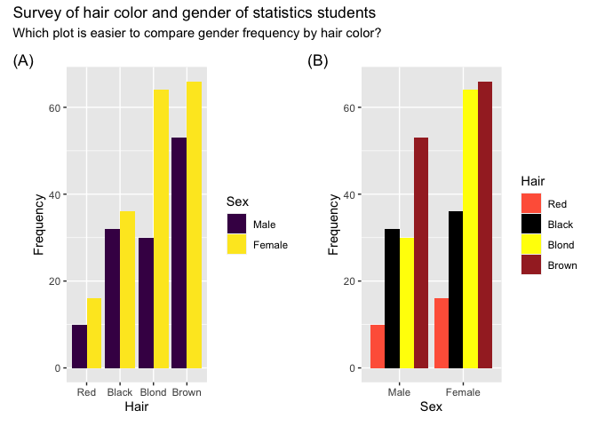<!-- -->

<blockquote>

Day 3️⃣ \#2

📝 Tip 2: use pre-attentive processing for communication

Viewers can notice certain features are absent or present without
focussing their attention on particular regions.

Which plot helps you to distinguish the data points quickly?

\#rstats \#rladies \#datavis

</blockquote>

``` r
library(tidyverse)
library(patchwork)
n <- 30
df2 <- tibble(x = runif(n), y = runif(n),
              type = sample(c(TRUE, FALSE), 
                            replace = TRUE, size = n,
                            prob = c(0.1, 0.9)))

base <-  ggplot(df2, aes(x, y)) + 
  labs(x = "", y = "") + 
  guides(shape = FALSE) +
  theme(axis.text = element_blank(),
        axis.ticks.length = unit(0, "mm"),
        legend.position = "none",
        text = element_text(size = 18))

g1 <- base + 
  geom_point(aes(shape = type), 
             color = "#006DAE", size = 5) + 
  labs(tag = "(A)")

g2 <- base +
  geom_text(aes(angle = ifelse(type, 0, 90), label = "T"), 
             color = "#746FB2", size = 5, fontface = "bold") + 
  labs(tag = "(B)") 

g3 <- base + 
  geom_point(aes(color = type), size = 5) + 
  labs(tag = "(C)") + 
  scale_color_manual(values = c("black", "#C8008F"))

g4 <- base +
  geom_point(aes(size = type), color = "violet") + 
  labs(tag = "(D)") + 
  scale_color_manual(values = c("black", "#C8008F"))

(g1 + g2) / (g3 + g4)
```

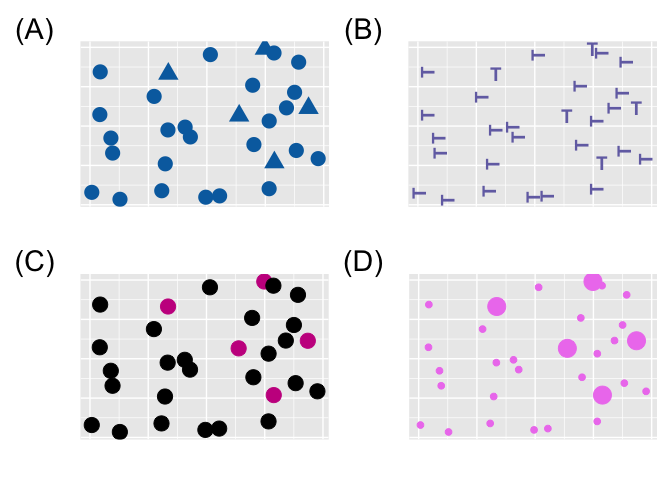<!-- -->

<blockquote>

Day 3️⃣ \#3

📝 Tip 3: focus & play with the bin size

When exploring your data, you may wanna restrict your attention to
subset of data at times (A)/(B).

Also play w/ bins in a histogram! There are peaks at particular times in
(C). Why do you think so?

\#rstats \#rladies \#datavis

</blockquote>

``` r
data(movies, package = "ggplot2movies")

g1 <- ggplot(movies, aes(length)) +
  geom_histogram(color = "white") + 
  labs(x = "Length of movie (minutes)", 
       y = "Frequency", tag = "(A)",
       title = "All data, bins = 30  (default)")

g2 <- movies %>% 
  filter(length < 180) %>% 
  ggplot(aes(length)) +
  geom_histogram(color = "white") + 
  labs(x = "Length of movie (minutes)",
       y = "Frequency", tag = "(B)",
       title = "Movies < 3 hours, bins = 30 (default)") 

g3 <- movies %>% 
  filter(length < 180) %>% 
  ggplot(aes(length)) +
  geom_histogram(binwidth = 1, fill = "#795549", color = "black") + 
  labs(x = "Length of movie (minutes)", 
       y = "Frequency", tag = "(C)",
       title = "Movies < 3 hours, binwidth = 1")

g1 / g2 / g3
```

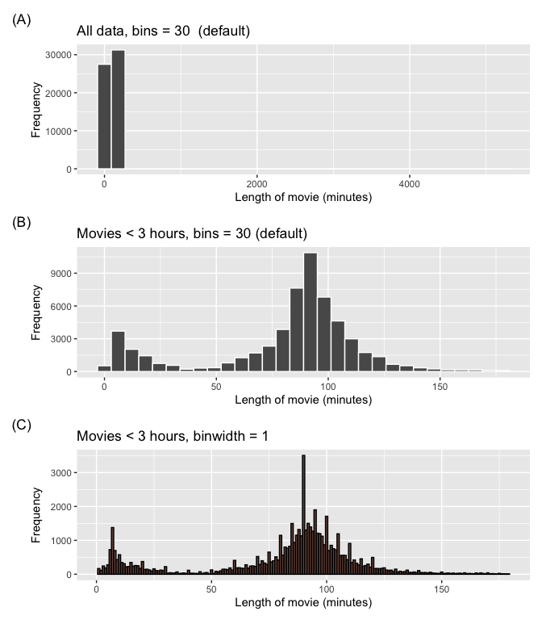<!-- -->

<blockquote>

Day 3️⃣ \#4

📝 Tip 4: plot a fitting statistics

Slope graphs (A) are popular to show before and after values but
comparing angles is harder for people – you may want to compute the
(relative) value change instead and plot that (B)/(C)

\#rstats \#rladies \#datavis

</blockquote>

``` r
data(urquhart.feedlot, package = "agridat")
df4 <- urquhart.feedlot %>% 
  pivot_longer(c(weight1, weight2), 
             names_to = "when",
             values_to = "weight") %>% 
  mutate(when = factor(as.character(when), 
                     labels = c("initial", "final"),
                     levels = c("weight1", "weight2")),
       diet = factor(diet, levels = c("High", "Medium", "Low")))

ggplot(df4, aes(when, weight, color = diet, group = animal)) + 
  geom_point(size = 3) + 
  facet_wrap(~herd, nrow = 2, labeller = label_both) + 
  geom_line() + 
  labs(x = "", y = "Weight", color = "Diet", tag = "(A)") 
```

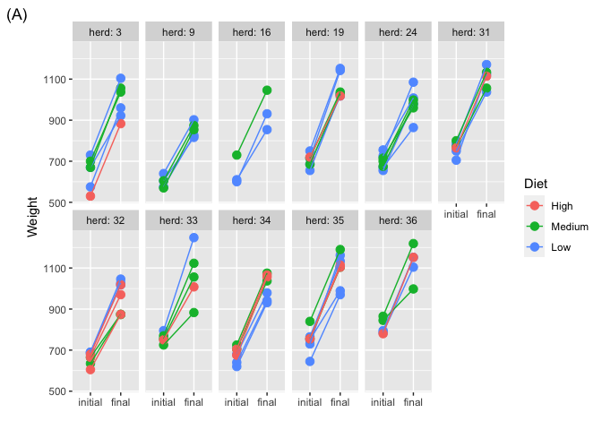<!-- -->

``` r
urquhart.feedlot %>% 
  mutate(herd = factor(herd),
         weight_change = weight2 - weight1,
         diet = factor(diet, levels = c("High", "Medium", "Low"))) %>% 
  ggplot(aes(herd, weight_change)) + 
  geom_point(aes(color = diet), alpha = 0.5, size = 3) + 
  labs(x = "Herd", y = "Weight change", color = "Diet", tag = "(B)") 
```

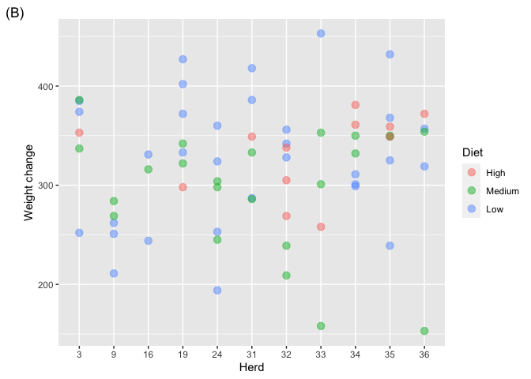<!-- -->

``` r
urquhart.feedlot %>% 
  mutate(herd = factor(herd),
         weight_change = (weight2 - weight1)/weight1,
         diet = factor(diet, levels = c("High", "Medium", "Low"))) %>% 
  ggplot(aes(herd, weight_change)) + 
  geom_point(aes(color = diet), alpha = 0.5, size = 3) + 
  labs(x = "Herd", y = "Relative weight change to inital weight", color = "Diet", tag = "C)") 
```

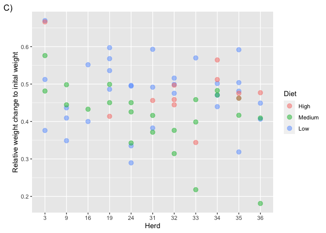<!-- -->

<blockquote>

Day 3️⃣ \#5

📝 Tip 5: facet with shadows

Many categories in a scatter plot is hard to compare.

Splitting data into multiple plots via facet makes it easier to compare.

Better yet, add a shadow of all data to make it easier compare to rest
of the data!

\#rstats \#rladies \#datavis

</blockquote>

``` r
library(ggplot2)
data(olives, package = "classifly")

ggplot(olives, aes(palmitoleic, palmitic, color = Area)) + 
  geom_point() + 
  scale_color_viridis_d() + 
  guides(color = "none") +
  labs(tag = "(A)")
```

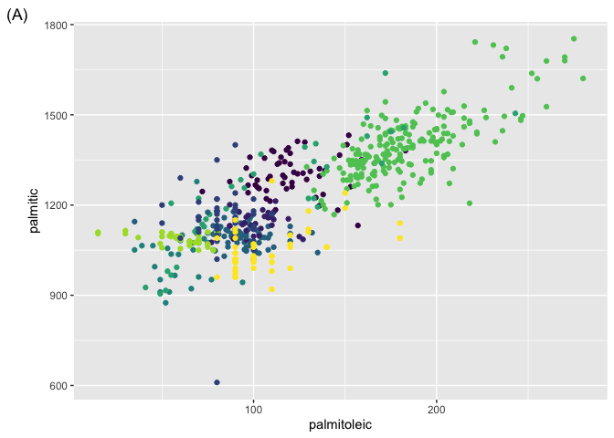<!-- -->

``` r
ggplot(olives, aes(palmitoleic, palmitic, color = Area)) + 
  geom_point() + 
  facet_wrap(~Area) + 
  scale_color_viridis_d() + 
  guides(color = "none") +
  labs(tag = "(B)")
```

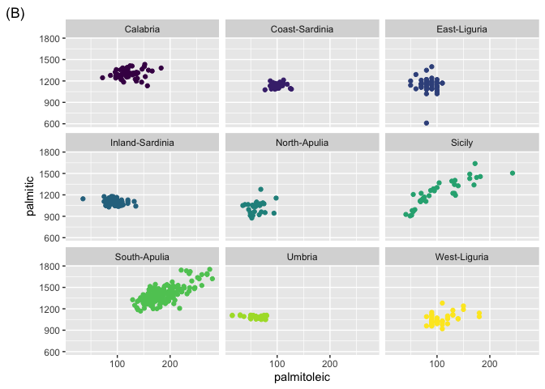<!-- -->

``` r
ggplot(olives, aes(palmitoleic, palmitic, color = Area)) + 
  geom_point(data = ~select(., -Area), color = "grey") +
  geom_point() + 
  facet_wrap(~Area) + 
  scale_color_viridis_d() + 
  guides(color = "none") +
  labs(tag = "(C)")
```

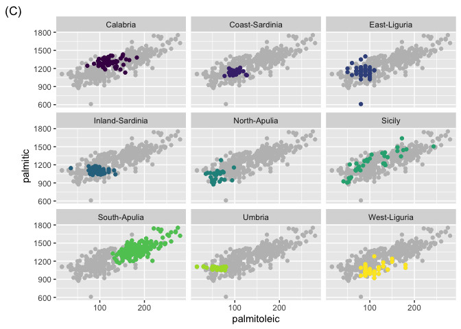<!-- -->

<blockquote>

Day 3️⃣ \#6

How do you know if what you see in the plot is real?

Too often inference from plots are treated in an informal manner.

Plot below shows a residual plot. Would you say there’s a trend?

\#rstats \#rladies \#datavis

</blockquote>

``` r
set.seed(2022)
data1 <- tibble(id = 1:100) %>% 
  mutate(x = runif(n(), -10, 10),
         y = x - 0.075 * x^2 + 3 + rnorm(n(), 0, 3)) 

fit1 <- lm(y ~ x, data = data1)

data1 %>% 
  mutate(residual = residuals(fit1)) %>% 
  ggplot(aes(x, residual)) + 
  geom_hline(yintercept = 0, color = "red") + 
  geom_point()
```

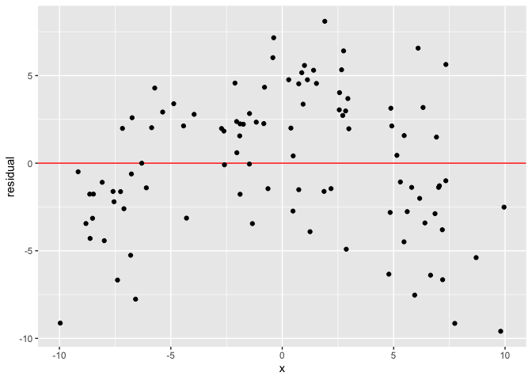<!-- -->

<blockquote>

Day 3️⃣ \#7

Using {nullabor} by @visnut & co, I now generate a lineup of “null
plots” – these plot residuals that are indeed generated from a iid
Normal.

Does any of the plots strike out different to you below? One plot is the
actual residual plot.

\#rstats \#rladies \#datavis

</blockquote>

``` r
library(tidyverse)
library(nullabor)
set.seed(2022-04-20)
data2 <- tibble(id = 1:100) %>% 
  mutate(x = runif(n(), -10, 10),
         y = x - 0.075 * x^2 + 3 + rnorm(n(), 0, 3)) 

fit2 <- lm(y ~ x, data = data2)

data2$.resid <- residuals(fit2)

null_lm(y ~ x, method = "pboot") %>% 
  lineup(data2) %>% 
  ggplot(aes(x, .resid)) +
  geom_hline(yintercept = 0, color = "red") + 
  geom_point() + 
  facet_wrap(~ .sample) +
  theme(axis.title = element_blank(),
        axis.text = element_blank(),
        axis.ticks.length = unit(0, "mm"))
```

    ## decrypt("sD0f gCdC En JP2EdEPn ZT")

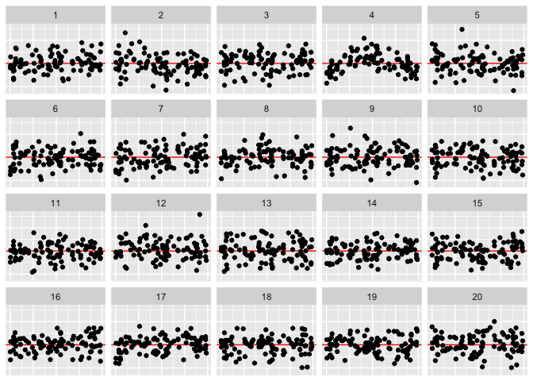<!-- -->

<details>
<summary>
Answer
</summary>

``` r
decrypt("sD0f gCdC En JP2EdEPn ZT")
```

    ## [1] "True data in position  4"

</details>
<blockquote>

Day 3️⃣ \#8

This features in {ggsvg} by @coolbutuseless is just hot off the press
but so very cool! 😎

Take an svg and use CSS selector to map parts of it different scales!

Here I’m plotting a wheat field trial where the inner color shows which
treatment it received and the outer color shows the yield 🌾

\#rstats \#rladies \#datavis

</blockquote>

``` r
library(ggsvg)

wheat_svg <- paste(readLines("https://www.svgrepo.com/download/214973/wheat.svg"), collapse = "\n")

agridat::goulden.latin %>% 
  ggplot(aes(factor(row), factor(col))) + 
  geom_point_svg(aes("css=path:fill" = trt,
                     "css=path:nth-child(2):fill" = yield),
                 svg = wheat_svg, size = 20) +
  scale_svg_fill_viridis_d(aesthetics = "css=path:fill",
                           option = "A") + 
  scale_svg_fill_distiller(aesthetics = "css=path:nth-child(2):fill",
                           palette = "YlGn", 
                           direction = 1) +
  guides("css=path:fill" = guide_legend(override.aes = list(size = 5))) +
  labs(x = "Row", y = "Column")
```

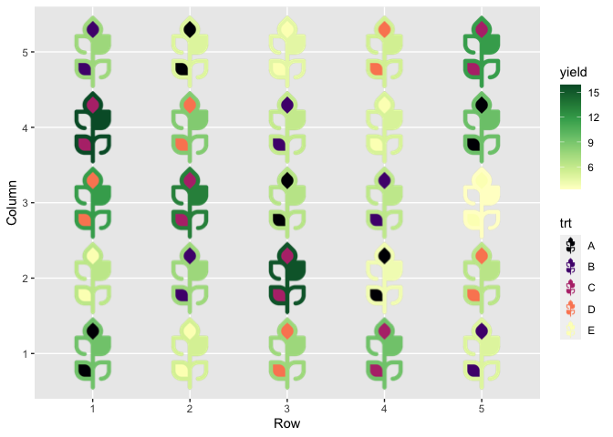<!-- -->

``` r
grid::grid.draw(svg_to_rasterGrob(wheat_svg))
```

<!-- -->
