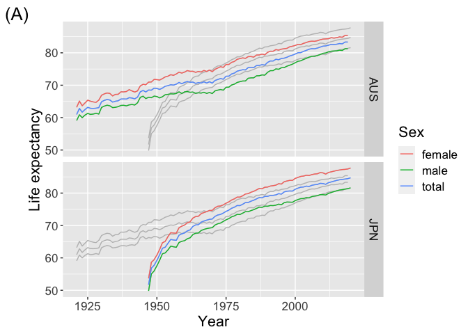
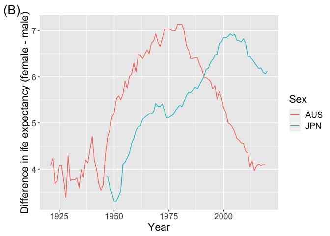
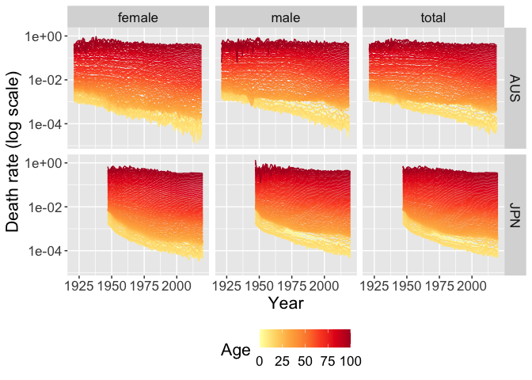
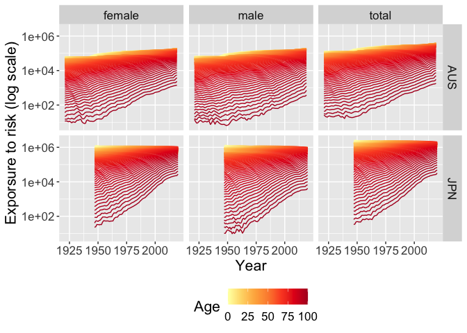
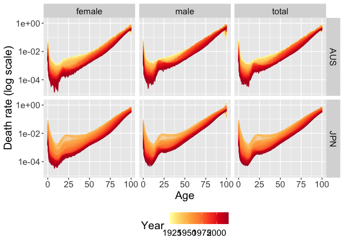
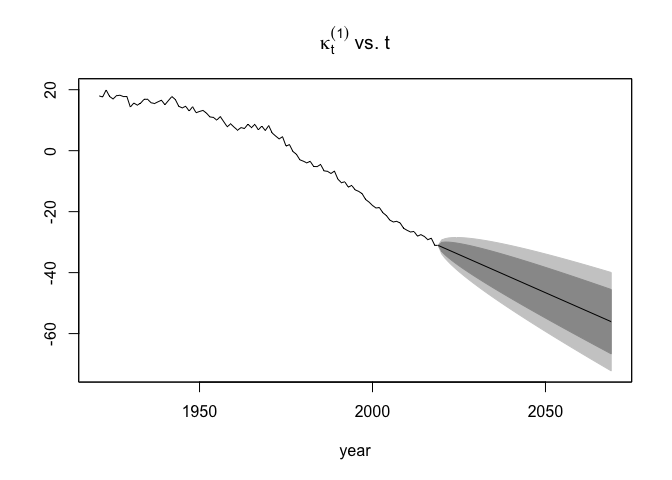
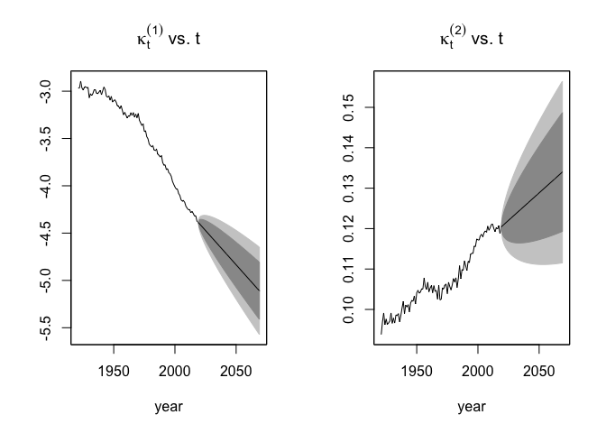

# Learn with me about *mortality modelling*

<blockquote>

Hi folks! Today’s topic is for the demographers and acturials out there:

Day 5️⃣ Mortality modelling

This is a topic I know the least about out of all topics but I got
interested from a chat with my colleague about an unified framework for
mortality modelling via:

📦🇦🇺 StMoMo @amvillegasr & co

\#rstats \#rladies

</blockquote>

``` r
library(tidyverse)
library(mortality)
hmd_session()
life_long <- hmd_data(country = c("AUS", "JPN"),
                      stats = "life_expectancy",
                      sex_format = "long")
life_wide <- hmd_data(country = c("AUS", "JPN"),
                      stats = "life_expectancy",
                      sex_format = "wide")
death_rate <- hmd_data(country = c("AUS", "JPN"),
                       stats = "death_rate", 
                       sex_format = "long")
death <- hmd_data(country = c("AUS", "JPN"),
                  stats = "death", 
                  sex_format = "long")
```

``` r
library(gganimate)
death_rate %>% 
  filter(age <= 100) %>% 
  ggplot(aes(year, deathrate, group = age)) +
  geom_line(aes(color = age)) +
  facet_grid(country ~ sex) +
  scale_y_log10() +
  scale_color_distiller(palette = "Set1") +
  theme(text = element_text(size = 16),
        legend.position = "bottom") +
  labs(x = "Year", y = "Death rate", color = "Age") +
  transition_reveal(year)
```

<!-- -->

<blockquote>

Day 5️⃣ \#1

📉 Before any modelling, we ought to know more about the data source &
make exploratory graphics to study it

👶 A number of \#rstats pkgs download the human mortality data but I
ended up creating my own to source the data in a tidy form 😅

<https://github.com/emitanaka/mortality>

\#rladies

</blockquote>

``` r
# install.packages("remotes")
# remotes::install_github("emitanaka/mortality")

library(mortality)
hmd_session()
life_long <- hmd_data(country = c("AUS", "JPN"),
                      stats = "life_expectancy",
                      sex_format = "long")
life_wide <- hmd_data(country = c("AUS", "JPN"),
                      stats = "life_expectancy",
                      sex_format = "wide")

life_long
```

    ## # A humble:  519 x 4
    ## # Countries: AUS, JPN
    ## # Year:      1921-2020
    ##     year country lifeexp sex   
    ##    <int> <chr>     <dbl> <chr> 
    ##  1  1921 AUS        63.2 female
    ##  2  1922 AUS        65.1 female
    ##  3  1923 AUS        63.7 female
    ##  4  1924 AUS        64.5 female
    ##  5  1925 AUS        65.4 female
    ##  6  1926 AUS        65.1 female
    ##  7  1927 AUS        64.8 female
    ##  8  1928 AUS        64.7 female
    ##  9  1929 AUS        65.4 female
    ## 10  1930 AUS        66.9 female
    ## # … with 509 more rows

``` r
life_wide
```

    ## # A humble:  173 x 5
    ## # Countries: AUS, JPN
    ## # Year:      1921-2020
    ##     year lifeexp_female lifeexp_male lifeexp_total country
    ##    <int>          <dbl>        <dbl>         <dbl> <chr>  
    ##  1  1921           63.2         59.1          61.0 AUS    
    ##  2  1922           65.1         60.9          62.8 AUS    
    ##  3  1923           63.7         60.0          61.7 AUS    
    ##  4  1924           64.5         60.8          62.5 AUS    
    ##  5  1925           65.4         61.3          63.2 AUS    
    ##  6  1926           65.1         61.0          62.9 AUS    
    ##  7  1927           64.8         61.1          62.8 AUS    
    ##  8  1928           64.7         61.3          62.9 AUS    
    ##  9  1929           65.4         61.1          63.1 AUS    
    ## 10  1930           66.9         63.2          64.9 AUS    
    ## # … with 163 more rows

<blockquote>

Day 5️⃣ \#2

👵🏻 They say people are living longer but is that really true?

⚥ They also say women live longer than men but is that also true?

I also heard that people in 🇯🇵 live long.

I’m going to take a closer at the data in Australia 🇦🇺 and Japan 🇯🇵 to
investigate 🔍

\#rstats \#rladies

</blockquote>

``` r
library(mortality)
hmd_session()

life_long <- hmd_data(country = c("AUS", "JPN"),
                      stats = "life_expectancy",
                      sex_format = "long")

life_wide <- hmd_data(country = c("AUS", "JPN"),
                      stats = "life_expectancy",
                      sex_format = "wide")

life_long %>% 
  ggplot(aes(year, lifeexp)) +
  geom_line(data = ~rename(., country2 = country), 
            aes(group = paste0(country2, sex)), 
            color = "grey") + 
  geom_line(aes(color = sex, group = sex)) + 
  facet_grid(country ~ .) + 
  labs(x = "Year", y = "Life expectancy", color = "Sex", tag = "(A)") +
  theme(text = element_text(size = 16))
```

<!-- -->

``` r
life_wide %>% 
  ggplot(aes(year, lifeexp_female - lifeexp_male)) +
  geom_line(aes(color = country)) + 
  labs(x = "Year", 
       y = "Difference in ife expectancy (female - male)", 
       color = "Sex", tag = "(B)") +
  theme(text = element_text(size = 16))
```

<!-- -->

<blockquote>

Day 5️⃣ \#3

🔍 We can also have a look at some other statistics provided

Plotting the death rate and exposure to risk (which I’m not sure how
it’s measured), I can see why there’s a number of people in demography
who do research in functional analysis!

\#rstats \#rladies

</blockquote>

``` r
library(tidyverse)
library(mortality)

mortals <- hmd_data(country = c("AUS", "JPN"),
                       stats = c("death_rate", "exposure_to_risk"), 
                       sex_format = "long")

mortals %>% 
  filter(age <= 100) %>% 
  ggplot(aes(year, deathrate, group = age)) +
  geom_line(aes(color = age)) +
  facet_grid(country ~ sex) +
  scale_y_log10() +
  scale_color_distiller(palette = "YlOrRd", direction = 1) +
  theme(text = element_text(size = 16),
        legend.position = "bottom") +
  labs(x = "Year", y = "Death rate (log scale)", color = "Age")
```

<!-- -->

``` r
mortals %>% 
  filter(age <= 100) %>% 
  ggplot(aes(year, exprisk, group = age)) +
  geom_line(aes(color = age)) +
  facet_grid(country ~ sex) +
  scale_y_log10() +
  scale_color_distiller(palette = "YlOrRd", direction = 1) +
  theme(text = element_text(size = 16),
        legend.position = "bottom") +
  labs(x = "Year", y = "Exporsure to risk (log scale)", color = "Age")
```

<!-- -->

<blockquote>

Day 5️⃣ \#4

🎯 Let’s now get to some mortality modelling with {StMoMo} 📦!

Most of what I know about mortality modelling comes from the talk at
@\_useRconf 2018 by @amvillegasr

You’ll also learn about what the name {StMoMo} stands for!

🎥 <https://www.youtube.com/watch?v=prk-0G689GU>

\#rstats \#rladies

</blockquote>

``` r
mortals %>% 
  filter(age <= 100) %>% 
  ggplot(aes(age, deathrate, group = year)) +
  geom_line(aes(color = year)) +
  facet_grid(country ~ sex) +
  scale_y_log10() +
  scale_color_distiller(palette = "YlOrRd", direction = 1) +
  theme(text = element_text(size = 16),
        legend.position = "bottom") +
  labs(x = "Age", y = "Death rate (log scale)", color = "Year")
```

<!-- -->

<blockquote>

Day 5️⃣ \#5

Most well known mortality model is the Lee-Carter model, others are CBD,
M7, APC, etc.

🤔 So how are these models different?

💡 {StMoMo} defines models with `StMoMo::StMoMo` in a way that is easier
to see the difference compared to a recipe approach

\#rstats \#rladies

</blockquote>

``` r
library(StMoMo)
# ingredients of the Lee-Carter model 
constLC <- function(ax, bx, kt, b0x, gc, wxt, ages) {
  c1 <- mean(kt[1, ], na.rm = TRUE)
  c2 <- sum(bx[, 1], na.rm = TRUE)
  list(ax = ax + c1 * bx, bx = bx / c2, kt =  c2 * (kt - c1))
}

LC <- StMoMo(link = "logit", staticAgeFun = TRUE, periodAgeFun = "NP",
             constFun = constLC)
LC
```

    ## Binomial model with predictor: logit q[x,t] = a[x] + b1[x] k1[t]

``` r
# above is the same as below
lc(link = "logit")
```

    ## Binomial model with predictor: logit q[x,t] = a[x] + b1[x] k1[t]

``` r
library(StMoMo)
# ingredients of the CBD model 
f2 <- function(x, ages) x - mean(ages)

CBD <- StMoMo(link = "logit", staticAgeFun = FALSE,
       periodAgeFun = c("1", f2))
CBD
```

    ## Binomial model with predictor: logit q[x,t] = k1[t] + f2[x] k2[t]

``` r
# above is the same as below
cbd()
```

    ## Binomial model with predictor: logit q[x,t] = k1[t] + f2[x] k2[t]

<blockquote>

Day 5️⃣ \#6

Using {StMoMo} you can easily get forecasts and diagnostic plots!

There’s more to this than I can explain.

📰 If you want more details check out the paper at
<https://www.jstatsoft.org/article/view/v084i03>

\#rstats \#rladies

</blockquote>

``` r
library(mortality)
library(StMoMo)

# get the data
AUdata <- hmd_data("AUS", c("death_rate", "exposure_to_risk")) %>% 
  as_demogdata() %>% 
  StMoMoData() %>% 
  central2initial()

# Fit the models
ages.fit <- 55:89
wxt <- genWeightMat(ages = ages.fit, years = AUdata$years, clip = 3)

LCfit <- fit(lc(link = "logit"), data = AUdata, ages.fit = ages.fit, wxt = wxt)
```

    ## StMoMo: The following cohorts have been zero weigthed: 1832 1833 1834 1962 1963 1964 
    ## StMoMo: Start fitting with gnm
    ## Initialising
    ## Running start-up iterations..
    ## Running main iterations......
    ## Done
    ## StMoMo: Finish fitting with gnm

``` r
CBDfit <- fit(cbd(), data = AUdata, ages.fit = ages.fit, wxt = wxt)
```

    ## StMoMo: The following cohorts have been zero weigthed: 1832 1833 1834 1962 1963 1964 
    ## StMoMo: Start fitting with gnm
    ## StMoMo: Finish fitting with gnm

``` r
forecast(LCfit, h = 50) %>% 
  plot(only.kt = TRUE)
```

<!-- -->

``` r
forecast(CBDfit, h = 50) %>% 
  plot(only.kt = TRUE)
```

<!-- -->
