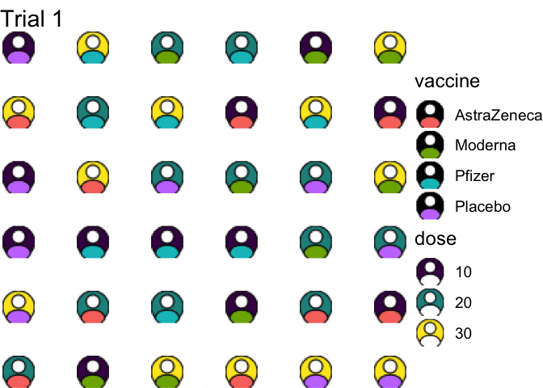

# Let’s talk *experimental design*

<blockquote>

So the last topic for my curatorship is a topic within my research:

Day 6️⃣ Experimental design

I’ll feature the following \#rstats packages:

📦🔧🇦🇺 edibble & deggust @statsgen

with glimpses of:

📦 AlgDesign Jerome Braun/Bob Wheeler 📦🇦🇺 dae Chris Brien

\#rladies

</blockquote>

``` r
library(tidyverse)
library(gganimate)
library(ggsvg)
library(edibble)


generate_fac <- function() {
  design("Factorial Design") %>%
    set_units(person = 36) %>%
    set_trts(vaccine = c("AstraZeneca", "Pfizer", "Moderna", "Placebo"),
             dose = c(10, 20, 30)) %>%
    allot_trts(~person) %>%
    assign_trts("random") %>%
    serve_table() %>% 
    as_data_frame() %>% 
    cbind(expand.grid(x = 1:6, y = 1:6))
}

df <- map_dfr(1:20, ~{
 generate_fac() %>% 
    mutate(id = .x)
})


svg_text <- '
  <svg viewBox="0 0 24 24">
    <circle cx="12" cy="12" r="12" fill="black" stroke="black"/>
    <circle cx="12" cy="8" r="5" fill="white" stroke="black"/>
  <path d="M3,21 c 0,0 9,12, 18,0  C 21,12 3,12 3,21" fill="white" stroke="black"/>
  </svg>
  '

ggplot(df) + 
  geom_point_svg(
    aes(
      x, y, 
      css("path", fill = vaccine), 
      css("circle:nth-child(1)", fill = dose)
    ), 
    svg = svg_text, 
    size = 10) +
  theme_void(base_size = 18) + 
  scale_svg_fill_discrete(aesthetics = css("path", "fill")) + 
  scale_svg_fill_viridis_d(aesthetics = css("circle:nth-child(1)", "fill")) +
  ggtitle("Trial {current_frame}") +
  transition_manual(id)
```

<!-- -->

<blockquote>

Day 6️⃣ \#1

🥐 {edibble} is to design experiments 🎯 it aims to provide you an
experimental design \#tibble

🍱 {deggust} is to easily visualise edibble experimental designs 🎯 it
aims to provide a \#ggplot output for quick communication, study or
publication

\#rladies \#rstats

</blockquote>
<blockquote>

Day 6️⃣ \#2

❓ So why {edibble}?

Keep in mind that experiments are human endeavours 👩‍🔬👩🏽‍💻👩🏻‍🌾

Most of the time is spent understanding & translating the experimental
structure to a form ready for software

Try to read the passage and figure out the structure 👇

\#rladies \#rstats

</blockquote>

``` r
library(edibble)
des <- design("Cookie recipe", seed = 2022) %>%
  set_trts(shortening = c("80%", "100%"),
           baking_temp = c("below", "at", "above"),
           tray_temp = c("hot", "room temp")) %>% 
  set_units(batch = 4,
            tray = nested_in(batch, 6)) %>% 
  allot_trts(shortening ~ batch,
             baking_temp:tray_temp ~ tray) %>% 
  assign_trts("random") %>% 
  serve_table()

des
```

    ## # Cookie recipe 
    ## # An edibble: 24 x 5
    ##    shortening baking_temp tray_temp     batch       tray
    ##      <trt(2)>    <trt(3)>  <trt(2)> <unit(4)> <unit(24)>
    ##  1       100%       at    room temp    batch1     tray1 
    ##  2       100%       below hot          batch1     tray2 
    ##  3       100%       above hot          batch1     tray3 
    ##  4       100%       at    hot          batch1     tray4 
    ##  5       100%       above room temp    batch1     tray5 
    ##  6       100%       below room temp    batch1     tray6 
    ##  7       80%        above hot          batch2     tray7 
    ##  8       80%        below hot          batch2     tray8 
    ##  9       80%        above room temp    batch2     tray9 
    ## 10       80%        below room temp    batch2     tray10
    ## # … with 14 more rows

<blockquote>

Day 6️⃣ \#3

Many experimental design 📦 tend to:

-   strip away experimental context, and/or
-   require users to have a complete understanding of the experimental
    structure

💡 {edibble} allows an incomplete structure with functions in more
understandable terms

\#rladies \#rstats

</blockquote>

``` r
library(edibble)
library(deggust)

des1 <- design("Strip-Plot Design") %>%
  set_units(block = 6,
            row = nested_in(block, 4),
            col = nested_in(block, 5),
            plot = nested_in(block, crossed_by(row, col))) %>%
  set_trts(variety = c("A", "B", "C", "D"),
           fertilizer = c("I", "II", "III", "IV", "V")) %>%
  allot_trts(variety ~ row,
             fertilizer ~ col) %>%
  assign_trts("random", seed = 2022) %>%
  serve_table()

autoplot(des1)
```

<!-- -->

``` r
library(edibble)
library(deggust)

des2 <- design("Laundry experiment") %>%
  set_units(location = 6,
            washer = nested_in(location, 4),
            dryer = nested_in(location, 5),
            sheet = nested_in(location, crossed_by(washer, dryer))) %>% 
  set_trts(wash_temp = 4,
           dry_temp = 5) %>% 
  allot_trts(wash_temp ~ washer,
              dry_temp ~ dryer) %>% 
  assign_trts("random", seed = 2022) %>% 
  serve_table()

autoplot(des2)
```

<!-- -->

<blockquote>

Day 6️⃣ \#4

Do you know what a Hyper-Graeco Latin Square Design is?

You can select from `menu_*` functions in {edibble} for named
experimental designs & `takeout()` for the table, but it also shows the
basic ingredients.

\#rladies \#rstats

</blockquote>

``` r
library(edibble)
library(deggust)
set.seed(2022)

menu_hyper_graeco() %>% 
  takeout() %>% 
  autoplot()
```

<!-- -->

``` r
# What is Hyper Graeco Latin Square Design??
# menu_hyper_graeco() is a shorthand for
design("Hyper-Graeco-Latin Square Design") %>%
  set_units(block1 = 8,
            block2 = 8,
            block3 = 8,
            block4 = 8,
            unit = crossed_by(block1, block2, block3, block4)) %>%
  set_trts(trt = 8) %>%
  allot_trts(trt ~ unit) %>%
  assign_trts("random", seed = 288) %>%
  serve_table() 
```

    ## # Hyper-Graeco-Latin Square Design 
    ## # An edibble: 4,096 x 6
    ##       block1    block2    block3    block4       unit      trt
    ##    <unit(8)> <unit(8)> <unit(8)> <unit(8)> <unit(4k)> <trt(8)>
    ##  1   block11   block21   block31   block41     unit1      trt3
    ##  2   block12   block21   block31   block41     unit2      trt1
    ##  3   block13   block21   block31   block41     unit3      trt5
    ##  4   block14   block21   block31   block41     unit4      trt7
    ##  5   block15   block21   block31   block41     unit5      trt2
    ##  6   block16   block21   block31   block41     unit6      trt4
    ##  7   block17   block21   block31   block41     unit7      trt8
    ##  8   block18   block21   block31   block41     unit8      trt6
    ##  9   block11   block22   block31   block41     unit9      trt1
    ## 10   block12   block22   block31   block41     unit10     trt8
    ## # … with 4,086 more rows

<blockquote>

Day 6️⃣ \#5

If you want to know more about {edibble} and {deggust}, you can find
this at the latest talk and WIP book by @statsgen

📖 <https://emitanaka.org/edibble-book> 📽️
<https://emitanaka.org/slides/toronto2022/#/title-slide> 🎥
<https://www.youtube.com/watch?v=sFdZb89Th9g>

\#rladies \#rstats

</blockquote>
<blockquote>

Day 6️⃣ \#6

Let’s talk about some experimental design concepts 💭

🛡️ Randomised designs help to protect against potential biases ☢️
Optimised designs are usually model-based

⚠️ Optimised designs are not necessary randomised 📝 Not all designs can
be randomised

\#rladies \#rstats

</blockquote>

``` r
library(AlgDesign)
# create a data frame describing the variables
dat <- gen.factorial(2, 3)
dat
```

    ##   X1 X2 X3
    ## 1 -1 -1 -1
    ## 2  1 -1 -1
    ## 3 -1  1 -1
    ## 4  1  1 -1
    ## 5 -1 -1  1
    ## 6  1 -1  1
    ## 7 -1  1  1
    ## 8  1  1  1

``` r
# optimise allocation
optBlock(~ X1 + X2 + X3 + X1:X3, # some model
         dat, blocksizes = c(4, 4),
         criterion = "D") 
```

    ## $D
    ## [1] 1
    ## 
    ## $diagonality
    ## [1] 1
    ## 
    ## $Blocks
    ## $Blocks$B1
    ##   X1 X2 X3
    ## 1 -1 -1 -1
    ## 2  1 -1 -1
    ## 7 -1  1  1
    ## 8  1  1  1
    ## 
    ## $Blocks$B2
    ##   X1 X2 X3
    ## 3 -1  1 -1
    ## 4  1  1 -1
    ## 5 -1 -1  1
    ## 6  1 -1  1
    ## 
    ## 
    ## $design
    ##   X1 X2 X3
    ## 1 -1 -1 -1
    ## 2  1 -1 -1
    ## 7 -1  1  1
    ## 8  1  1  1
    ## 3 -1  1 -1
    ## 4  1  1 -1
    ## 5 -1 -1  1
    ## 6  1 -1  1
    ## 
    ## $rows
    ## [1] 1 2 7 8 3 4 5 6

``` r
# but if block is the same size as the number of treatments, 
# the result is a systematic design
optBlock(~ X1 + X2 + X3 + X1:X3, # some model
         dat, blocksizes = c(8, 8),
         criterion = "D") 
```

    ## $D
    ## [1] 1
    ## 
    ## $diagonality
    ## [1] 1
    ## 
    ## $Blocks
    ## $Blocks$B1
    ##   X1 X2 X3
    ## 1 -1 -1 -1
    ## 2  1 -1 -1
    ## 3 -1  1 -1
    ## 4  1  1 -1
    ## 5 -1 -1  1
    ## 6  1 -1  1
    ## 7 -1  1  1
    ## 8  1  1  1
    ## 
    ## $Blocks$B2
    ##   X1 X2 X3
    ## 1 -1 -1 -1
    ## 2  1 -1 -1
    ## 3 -1  1 -1
    ## 4  1  1 -1
    ## 5 -1 -1  1
    ## 6  1 -1  1
    ## 7 -1  1  1
    ## 8  1  1  1
    ## 
    ## 
    ## $design
    ##    X1 X2 X3
    ## 1  -1 -1 -1
    ## 2   1 -1 -1
    ## 3  -1  1 -1
    ## 4   1  1 -1
    ## 5  -1 -1  1
    ## 6   1 -1  1
    ## 7  -1  1  1
    ## 8   1  1  1
    ## 9  -1 -1 -1
    ## 10  1 -1 -1
    ## 11 -1  1 -1
    ## 12  1  1 -1
    ## 13 -1 -1  1
    ## 14  1 -1  1
    ## 15 -1  1  1
    ## 16  1  1  1
    ## 
    ## $rows
    ##  [1] 1 2 3 4 5 6 7 8 1 2 3 4 5 6 7 8

<blockquote>

Day 6️⃣ \#7

📝 All variables in experiments are confounded

But the degree of confounding can differ.

⚠️ Avoid completely confounding your variables of interest with other
variables in your experiment.

📦 You can see the design anatomy in {edibble}, powered by {dae}. You
want to avoid 0 df and low efficiency!

\#rladies \#rstats

</blockquote>

``` r
library(edibble)
des <- design("Mimicing PBIBD from Cochran and Cox (1957)") %>% 
  set_units(block = 6, 
            unit = nested_in(block, 4)) %>% 
  set_trts(trt = 6) %>% 
  allot_table(trt ~ unit)

# Avoid df = 0 and low efficiencies!
anatomy(des)
```

    ## 
    ## 
    ## Summary table of the decomposition for unit & trt (based on adjusted quantities)
    ## 
    ##  Source.unit df1 Source.trt df2 aefficiency eefficiency order
    ##  block         5 trt          4      0.0937      0.0625     2
    ##                  Residual     1                              
    ##  unit[block]  18 trt          5      0.8937      0.8125     3
    ##                  Residual    13                              
    ## 
    ## The design is not orthogonal
